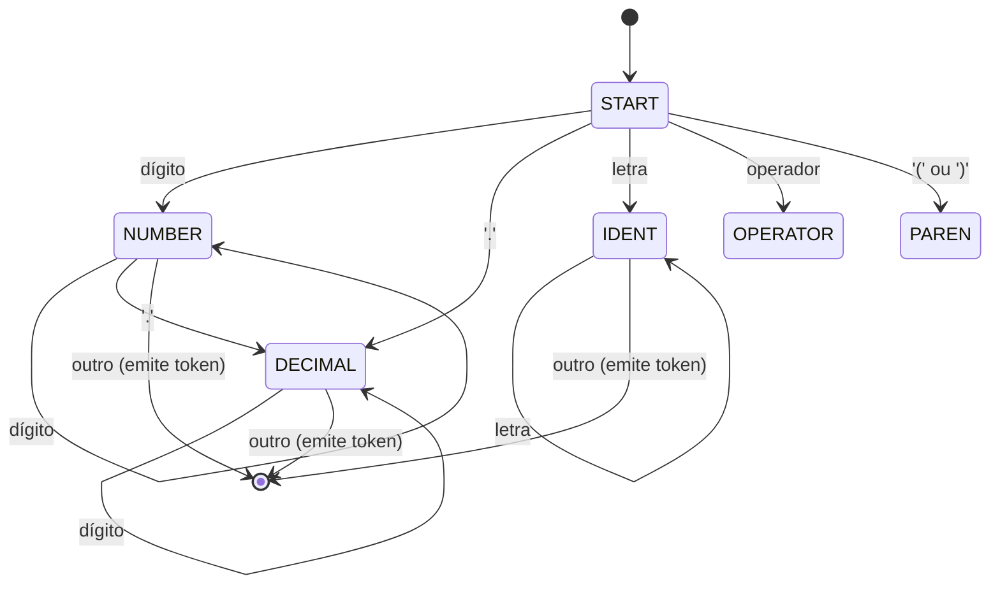

# Projeto Fase 02 - Análise Léxica e Sintática

## Grupo
Compiladores_2025 - Ana Silva, Bruno Costa, Carla Lima, Diego Nunes

## Descrição
Este projeto implementa um analisador léxico e sintático para uma linguagem baseada em RPN (Notação Polonesa Reversa), conforme edital da disciplina. O código está em Python e simula operações aritméticas, comandos especiais, memória, aninhamento, além de reconhecer palavras-chave para controle de fluxo.

## DFA do Analisador Léxico
O analisador léxico foi implementado como uma máquina de estados finitos determinística (DFA), conforme exigido.

**Estados:**
- START: início, ignora espaços, identifica tipo do próximo token.
- NUMBER: reconhece números inteiros e reais.
- DECIMAL: parte decimal de número real.
- IDENT: reconhece comandos/palavras-chave (RES, MEM, IF, FOR, THEN, ELSE).
- OPERATOR/PAREN: reconhece operadores e parênteses.
- ERROR: caractere inválido.

**Transições:**
- START: [dígito] → NUMBER, [.] → DECIMAL, [letra] → IDENT, [()+-*/%|^] → OPERATOR/PAREN
- NUMBER: [dígito] → NUMBER, [.] → DECIMAL, outro → emite NUMBER, volta ao START
- DECIMAL: [dígito] → DECIMAL, outro → emite NUMBER, volta ao START
- IDENT: [letra] → IDENT, outro → emite IDENT, volta ao START

### Diagrama (Mermaid)


### Simulador DFA
Incluído no projeto: [`dfa_simulator.py`](dfa_simulator.py)

**Uso:**
```bash
python dfa_simulator.py "(5 3 +) (MEM)"
```
Saída:
```
Tokens: [{'value': '(', 'type': 'PAREN', 'position': 0}, ...]
```

### Exemplos
- Aceita: `(5 3 +)`, `(10 MEM)`, `(IF THEN ELSE)`, `(2.5 3.1 +)`
- Rejeita: `(5..3 +)`, `(10 @ MEM)`, `(5 3 +++ )`

### Exemplos de Aceitação e Não Aceitação
- Aceito: `(2 3 +)` → tokens: PAREN, NUMBER, NUMBER, OPERATOR, PAREN
- Não aceito: `(2..3 +)` → ERRO em número
- Aceito: `(IF THEN ELSE)` → todos reconhecidos como KEYWORD
- Não aceito: `(5 3 @)` → ERRO em '@'

## Checklist de Conformidade
- [x] Leitura de arquivo .txt via linha de comando
- [x] Impressão da string de tokens para cada linha
- [x] Operadores, comandos especiais e aninhamento
- [x] Reconhecimento de IF, FOR, THEN, ELSE (palavras-chave)
- [x] DFA implementado e documentado
- [x] Simulador DFA incluso e instrução de uso
- [x] Testes cobrindo operações, comandos, aninhamento e erros
- [x] Cabeçalho de autoria no código
- [x] README com explicação, diagrama, exemplos e checklist

## Data de início e entrega do projeto
- Início: 21/04/2025
- Término: 07/05/2025
